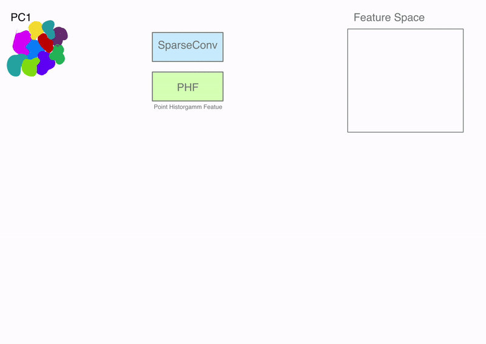

# GrowSP: Unsupervised Semantic Segmentation of Construction Site Point Clouds

This repository provides our implementation of GrowSP for unsupervised semantic segmentation of 3D construction site point clouds.
The original GrowSP repository: https://github.com/vLAR-group/GrowSP

## Demo



*Above: Demonstration of GrowSP.*

## Installation

### Docker Installation

To get started:

1. **Pull the Docker Image**

   ```bash
   docker pull yarinpour/growsp_nvidia:latest
   ```

2. **Install Required Python Libraries**

   Once inside the container, execute the following commands to fix and add some Python libraries:

   ```bash
   conda uninstall qhull
   conda uninstall pclpy
   conda install -c conda-forge/label/gcc7 qhull
   conda install -y -c conda-forge -c davidcaron pclpy
   ```
   ```bash
   pip install laspy[lazrs,laszip]
   ```

## Running the Code

A subset of our dataset is available here: [Download Dataset](https://tubcloud.tu-berlin.de/s/cjmKfq3zA3tj2rw)

### 1. Pre-processing

Prepare the dataset for training by running the pre-processing script:

```bash
python data_prepare/pre_processing_full_pipeline.py \
--input_path <path to raw point clouds> \
--output_path <path where to save the outputs>
```

This command tiles each point cloud, removes ground points, and generates initial regions based on our method. The results are organized into two subdirectories under your specified output path:
- `input_superpoints`: Contains the initial regions for each point cloud.
- `input_plys`: Contains the processed point clouds ready for training.

A preprocessed dataset is also available here: [Preprocessed Dataset](https://tubcloud.tu-berlin.de/s/tKPrMNJ9nPpdYtd)

### 2. Training

Train the model with the following command. You can adjust hyperparameters as needed:

```bash
python train_const_site_yarin.py \
--data_path <path to input_plys folder> \
--sp_path <path to input_superpoints folder> \
--save_path <path to save the model> \
--pseudo_label_path <path to save pseudo labels> \
--voxel_size 0.15 --primitive_num 300 --batch_size 8 --growsp_start 80 --growsp_end 30
```
note that there are more hyperparameters that can be changed.
The output model, evaluation scores (silhoutte, wcss) and a log file will be saved in the specified output directory.

Our trained models can be found here: [Trained Models](https://tubcloud.tu-berlin.de/s/YFrRN5RmPTRoYcJ)

### 3. Visual Evaluation and Inference

For visual evaluation and inference on new point cloud data, run the following command. Make sure that the `primitive_num` and `voxel_size` parameters match those used during training. You can set the number of segmentation classes using the `semantic_class` argument:

```bash
python post_processing_const_site.py
--data_path <path to input point clouds in ply format> \
--save_path <path to the folder of the trained model> \
--vis_path <path to save the segmented point clouds> \
--semantic_class 18 \
--primitive_num 300 --voxel_size 0.3
```

All of the segmented point clouds we used for visual evaluation are stored on the HPC at `/scratch/yarinp/vis`. The folder is divided into five subdirectories corresponding to different models we trained:

- `model300`
- `model500`
- `model_grow_11500_2850`
- `model_grow_2875_712`
- `model_noground_v15`

Each model folder contains further subdirectories for point cloud segmentations with different numbers of classes.


## SAMPLES ???


*Above: Demonstration of the selected models with RAW data.*
